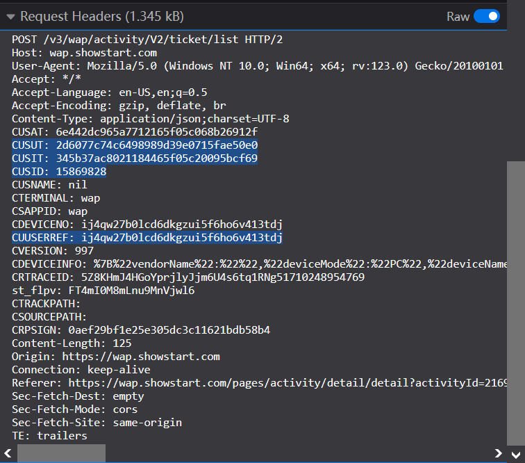

# Showstart

## 功能

实现秀动自动化购票接口请求

## 使用方法

1. node.js安装crypto-js库

2. 修改配置文件

```json
{
	// CUUSERRET, 生成方式只和浏览器有关
    "CUUSERRET": "y6pcnr8bi5r7648jrphqruqmq6u1xl7l",
    // CUSUT, 账号重新登录后刷新
	"sign": "2d6077c74c6498989d39e0715fae50e0",
    // CUSIT, 前端每隔一定时间或请求list, confirm和order接口前调用refresh_token刷新, 每次需要重新获取
	"id_token": "38d92a8d13cbc01f65f11ca1ccb0ab16",
    // CUSID, 只与账号有关
	"userid": "12345678",
    // 实名制观演人id, 与账号无关, 非实名制订单空着, 实名观演人认证后在选择观演人界面打开下拉菜单, 即可看到对应请求抓取观演人id
    "audience": [""],
    // 账号手机号
	"mobile": "12345678901",
    // 演出ID
	"activityId": "222390",
    // 门票ID
	"ticketId": "c19a52e658bade5b3608e09a9c5e4194",
    // 购票数量
	"ticketNum": "2",
    // 开票时间
	"start_time": "2024-03-12 10:00:00",
    // order请求间隔, 0代表只请求一次
	"request_interval": 1.8
}
```

其中如下参数在请求头中抓取



3. Windows使用如下命令运行showstart.exe

   ```
   showstart
   ```

   Linux使用如下命令运行showstart

   ```
   ./showstart
   ```

   运行程序时，请关闭代理

## 更新说明

0.0.0 初始版本，接口测试

0.0.1 请求频率测试

0.0.2 使用异步并发请求（无用，中止开发）

0.0.3 使用多线程请求（无用）

0.0.4 单线程添加代理功能

0.0.5 多线程添加代理功能

0.1.0 删除多线程和代理功能，优化了请求时间

0.1.1 优化了请求时间，参数写入config.json

## 其他

由于违反相关条款，为防止滥用，本项目闭源且随时可能停止开发。